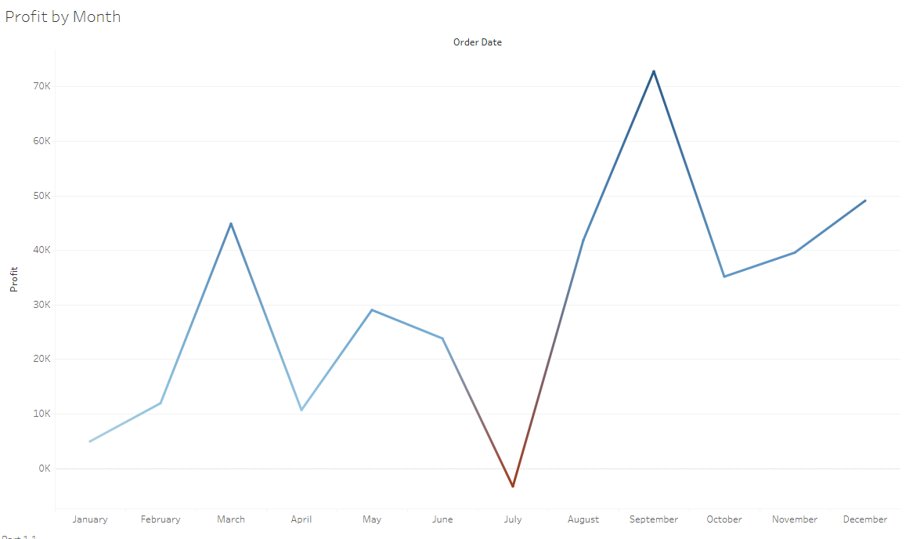
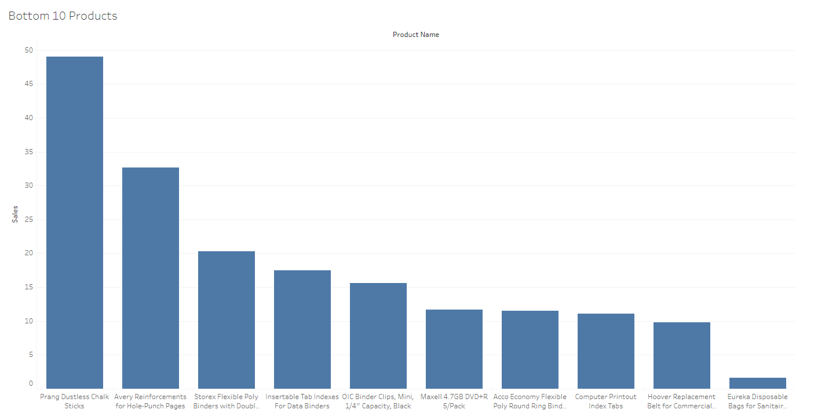
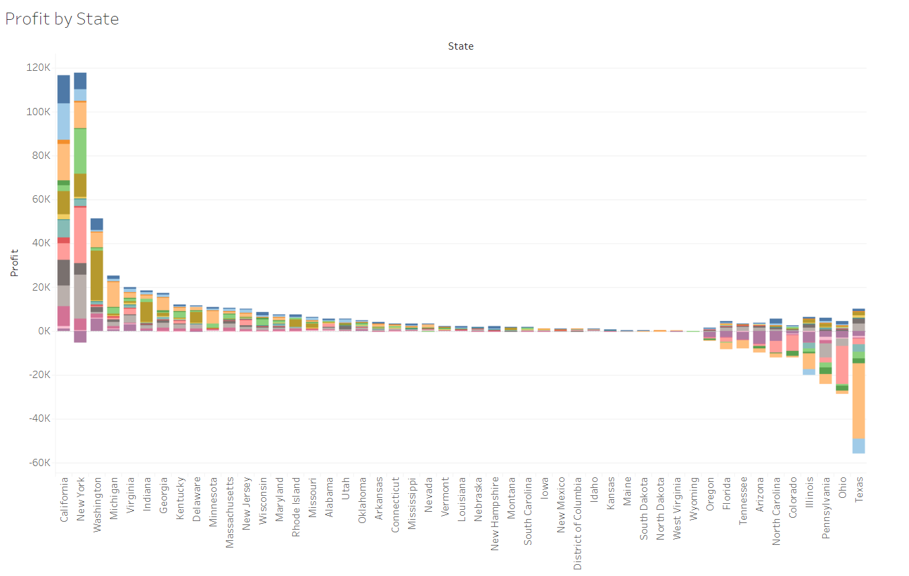
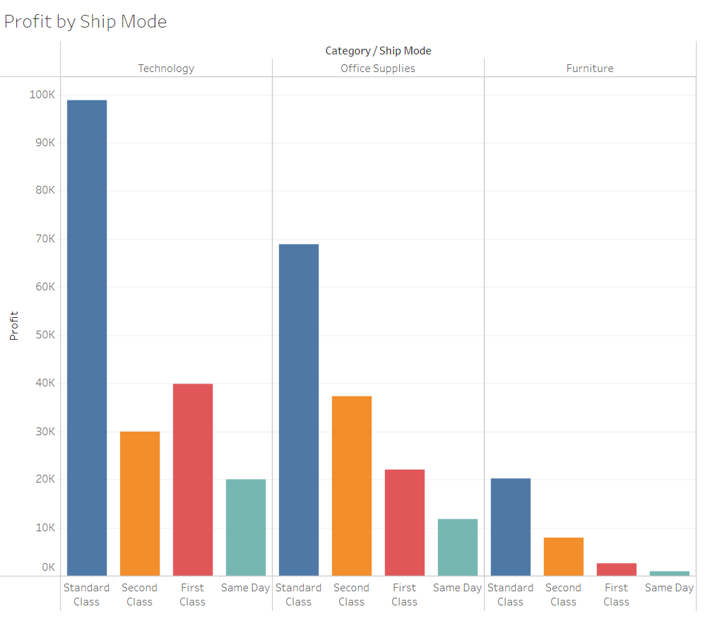
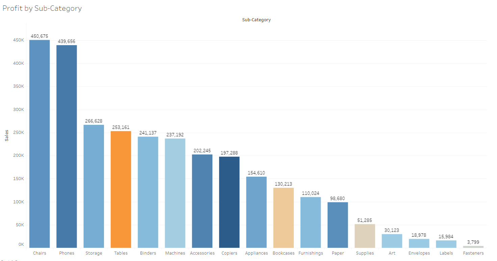

# Superstore Data Analysis in Tableau

## Introduction

This project presents an analytical review of a Superstore's sales and operations data through Tableau visualizations. The focus is on dissecting the company's financials to unearth the primary centers of profit and loss, enabling strategic decision-making to enhance financial performance.

## Objectives

The main objective of this analysis is to identify the major profit and loss centers within the Superstore's operations. This includes pinpointing specific months and states that significantly influence the company's financial performance, with the aim of informing targeted improvements in sales strategies and operational efficiencies.

## Methodology

I leveraged Tableau to analyze the Superstore's sales data, creating a series of visualizations that map out the financial landscape. This involved:
- Tracking monthly profit trends to identify seasonal patterns.
- Assessing product performance to distinguish top-selling and underperforming items.
- Evaluating sales and profits by state to locate regional disparities.

## Visual Documentation

The following visualizations were key to identifying profit and loss centers:

*Figure: The line chart represents the monthly profit trends, highlighting New York State in September as a major profit center.*

*Figure: This bar chart delineates the least performing products, suggesting areas where the Superstore could optimize its product offerings.*

*Figure: A stacked bar chart showing profit by state, with Texas in July marked as a notable loss center.*

*Figure: Profitability analysis by shipping mode, providing insights into operational costs and efficiency.*

*Figure: The bar chart breaks down profit by sub-category, directing attention to the most and least profitable lines.*

## Dashboard Link

For a comprehensive, interactive view of the Superstore's financials, please visit the Tableau dashboard at the following link:

[Superstore Financial Analysis Dashboard](https://public.tableau.com/app/profile/victor.soberanis/viz/RegionalSalesbyCategory/Dashboard1?publish=yes)

## Conclusion

The analysis has pinpointed the key months and states contributing to profits and losses, providing a clear direction for strategic focus. New York's peak performance in September and Texas's downturn in July highlight opportunities for targeted sales initiatives and operational adjustments.

Insights on product sales have identified which items to promote or reconsider, enabling data-driven decisions to optimize inventory and marketing strategies. With these findings, the Superstore can strengthen profitable areas and address underperforming ones.

## Business Outcomes

My recommendations for the Superstore, derived from the data analysis, include:

- **Maximize Sales in Key Months**: Increase marketing efforts in New York during September, leveraging its high-profit potential.
- **Address Seasonal Losses**: Develop tailored promotions for Texas in July to counteract the identified loss trend.
- **Optimize Product Portfolio**: Prioritize stocking and promotion of Chairs and Phones—categories shown to drive profits.
- **Rethink Low Performers**: Scale back or discontinue products like Fasteners, Labels, and Envelopes that consistently underperform, reallocating resources to more profitable items.
- **Refine Shipping Strategies**: Align shipping modes with category performance, focusing on the most efficient options to maximize profit margins.

Implementing these specific actions will help the Superstore enhance its profitable sectors and mitigate losses, resulting in a more robust financial performance.

The dashboard provided will serve as a tool for the Superstore's management to regularly monitor these financial metrics and make data-driven decisions.
