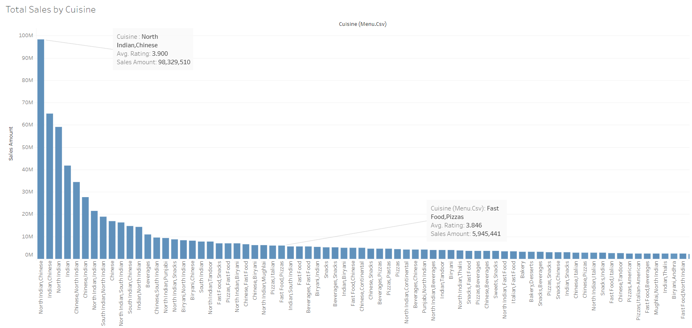
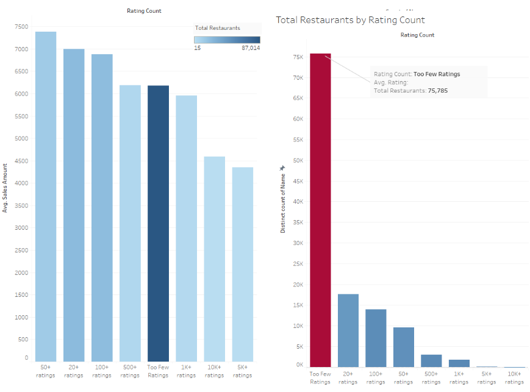

# Zomato Restaurant Sales and Ratings Analysis

## Introduction

In this report, I delve into the intricate details of sales and customer ratings data for restaurants listed on Zomato, with a focus on the Indian marketplace. By harnessing the power of Tableau visualizations, I aim to decode the patterns and trends that contribute to the success of these businesses, offering insightful data to industry stakeholders.

## Objectives

My analysis is driven by:
- Analyze and interpret sales data across various cities and cuisines to understand market behavior.
- Investigate the relationship between customer ratings and sales figures.
- Pinpoint cuisines and locales that are key opportunities for business growth.

## Visual Documentation

The visualizations from the analysis are as follows:

*Figure 1: A bar chart that showcases sales performance across different cities, with a special focus on the outstanding sales volume in Tirupati.*

*Figure 2: A bar chart showing the total sales by cuisine, which emphasizes the popularity of Indian and Chinese dishes.*

*Figure 3: This chart details the average sales by cuisine, where Indian-Thai fusion cuisine is seen leading in revenue.*

*Figure 4: A scatterplot that explores the complex relationship between average ratings and sales.*

*Figure 5: This comparative analysis pairs the average sales amount with the total number of restaurants by rating count.*

*Figure 6: A line graph showing the sales trends over time, with a significant downturn noted during the pandemic period.*

*Figure 7: A line chart illustrating the monthly sales trends, indicating strategic periods for marketing based on peaks and troughs.*

## Conclusion

The Zomato dataset analysis reveals that traditional Indian and Chinese dishes maintain their lead in the market, reflecting established consumer preferences. However, the success of Indian-Thai and American offerings illustrates the market's receptivity to emerging and diverse culinary experiences, even among less-reviewed establishments. Additionally, the relationship between review volume and sales is weak, suggesting other factors influence revenue. Sales trends also indicate a possible market recovery, moving upwards after a period of decline.
## Plans for Data Correction

I have noted a couple of discrepancies in my initial analysis that need to be addressed:

- **Clarifying Rating Counts**: I will refine my approach to ensure accurate representation of restaurants that may appear in both "10k+ Ratings" and "Too Few Ratings" categories.

- **Revising Average Rating Calculation**: I will modify the calculation of the average rating to more accurately reflect the true sentiment of customer feedback, by considering the rating in conjunction with the count of each rating.

I am committed to rectifying these issues and will release an updated version of the analysis upon completion of the review.

## Recommendations

Based on my findings, I suggest that restaurant owners and stakeholders on the Zomato platform:
- Look into the untapped potential in cities like Tirupati.
- Focus on enhancing offerings in popular cuisines such as Indian and Chinese
- Explore emerging trends like Indian-Thai fusion and American cuisine.
- Refine operational strategies in response to customer feedback and market trends.

## Additional Resources

For further exploration of the data or to delve deeper into my analysis, the following resources are available:

- **Processed Data CSV**: Access the processed dataset for this analysis in CSV format, available for download on Google Drive. [Download Processed Data CSV](https://drive.google.com/file/d/1NThVGzBf2BkQHAJUvPptbJlODNliPWuS/view?usp=sharing)

- **Comprehensive Report**: Read the detailed report with all methodologies, visualizations, and conclusions on Google Docs. [Read the Full Report](https://docs.google.com/document/d/1UeKdSzt0yMK2_hG0xzm6i5yev10MDjbPn2EJqFxLLtw/edit?usp=sharing)

- **Tableau Dashboard**: Explore the interactive Tableau dashboard for a dynamic and in-depth analysis experience. [Access Tableau Dashboard](https://public.tableau.com/views/RestaurantAnalysis-ZomatoDataset/AvgSalesMonth?:language=en-US&publish=yes&:display_count=n&:origin=viz_share_link)

